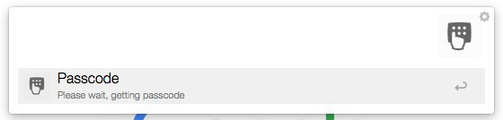

# Jump server passcode workflow for Alfred v2

> For security, one should login jump server before work on product server. Usually we use authorize by dynamic passcode.
After enter ssh command, we need to switch mail application to get passcode.  It's inconvenience. And make me crazy.

This workflow could help you get dynamic passcode convenience. Don't need to switch between the apps any more!

## Install

You can install this workflow by dowloading the [passcode.alfredworkflow](https://github.com/kkfnui/passcode/raw/master/passcode.alfredworkflow) file and then double-clicking it,
 or dragging it onto the Alfred Workflow screen.

After adding it to your workflow collection, be sure to set the correct params to your email account by double-clicking the `Script Filter` and replacing
 `USER@xunlei.com`, `pop3.xunlei.com`, `PASSWORD` with the actual value of your email account.
 
For more convenient, double-clicking the `Hotkey` and set the shortcut key.

## Usage

Use the shortcut set before, or type key word `pc` in alfred.

